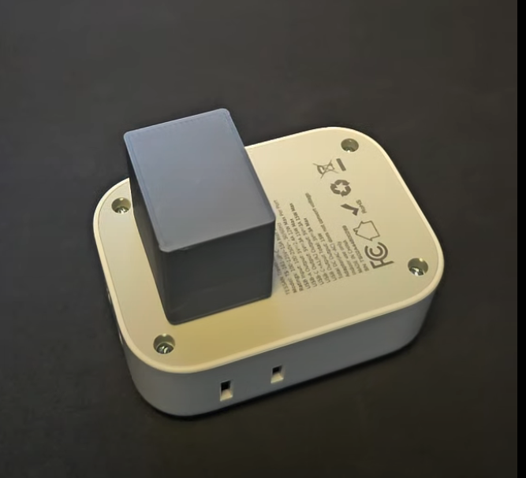

# Tessan Travel Adapter Cover
A 3D printable cover designed to protect the Japanese plug prongs on the Tessan Universal Travel Adapter, making it more comfortable to carry in bags.

## Overview
This is a friction-fit protective cover for the Japanese/Type A plug configuration of the Tessan Universal Travel Adapter. The cover prevents the prongs from poking through bags or potentially getting damaged during transport.

## Files Included
- `Tessan Plug Cover.stl` - Ready to print STL file
- `Tessan Plug Cover.obj` - OBJ format for editing

## Printing Guidelines
- Material: PLA recommended
- Layer Height: 0.2mm
- Infill: 20-30%
- No supports needed
- Print orientation: Flat side down

**Note:** You may need to scale the model up or down by 1-3% depending on your printer calibration and filament properties to achieve the ideal friction fit.

## Installation
The cover should slide firmly onto the plug prongs and stay in place through friction. If the fit is too tight or loose, adjust the scaling accordingly in your slicer.

## Compatibility
Designed specifically for the [Tessan Universal Travel Adapter (Amazon Link)](https://www.amazon.com/dp/B0D3Q3JJJX/). While it may fit similar adapters, fit is not guaranteed for other models.

## License
MIT License

Copyright (c) 2025

Permission is hereby granted, free of charge, to any person obtaining a copy of this software and associated documentation files (the "Model"), to deal in the Model without restriction, including without limitation the rights to use, copy, modify, merge, publish, distribute, sublicense, and/or sell copies of the Model, and to permit persons to whom the Model is furnished to do so, subject to the following conditions:

The above copyright notice and this permission notice shall be included in all copies or substantial portions of the Model.

THE MODEL IS PROVIDED "AS IS", WITHOUT WARRANTY OF ANY KIND, EXPRESS OR IMPLIED, INCLUDING BUT NOT LIMITED TO THE WARRANTIES OF MERCHANTABILITY, FITNESS FOR A PARTICULAR PURPOSE AND NONINFRINGEMENT. IN NO EVENT SHALL THE AUTHORS OR COPYRIGHT HOLDERS BE LIABLE FOR ANY CLAIM, DAMAGES OR OTHER LIABILITY, WHETHER IN AN ACTION OF CONTRACT, TORT OR OTHERWISE, ARISING FROM, OUT OF OR IN CONNECTION WITH THE MODEL OR THE USE OR OTHER DEALINGS IN THE MODEL.

## Contributing
Feel free to submit issues and pull requests for any improvements.
